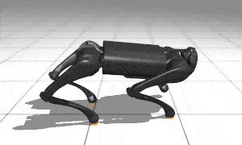
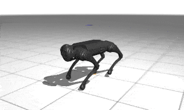
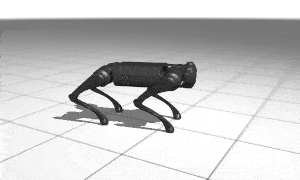

# Adopting The Template to Make A New PPO Policy For Mujoco Go1 Tasks

## File Description
- `ppo.py`: Implement a MLP network as well as the `Controller` interfaces based on the repo template
- `env_wrapper.py` A wrapper to mujoco env to the `Env` interface of the repo template
- `demo.py`: The demo script. Result is shown below.

## Result
  

## Requirements
- `mujoco`
- `mujoco_mjx`
- `brax`
- `mujoco_playground`
- `mediapy`
- `tqdm`

## Installation
```bash
pip install mujoco mujoco_mjx brax playground mediapy
```

## Execution
### In colab
See [`colab_demo`](colab_demo.ipynb) notebook or [](https://colab.research.google.com/github/shaoanlu/control_system_project_template/blob/main/examples/mujoco_Go1/colab_demo.ipynb)

### Local
```bash
# navigate to root folder of the repo
python3 examples/mujoco_Go1/demo.py  --env_name Go1Handstand
# or
python3 examples/mujoco_Go1/demo.py  --env_name Go1JoystickFlatTerrain
```
