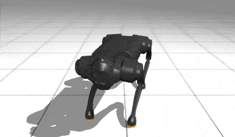

# Adoptingg The Template to Make A New PPO Policy For Go1 Handstand Task

## File Description
- `ppo.py`: this file is a wrapper for PPO agen in brax to fit the interface of the repo template
- `env_wrapper.py` this file is a wrapper to mujoco env to fit the interface of the repo template
- `demo.py`: the demo script. Result is shown below

## Result


## Requirements
- `mujoco`
- `mujoco_mjx`
- `brax`
- `mujoco_playground`
- `mediapy`
- `tqdm`

## Installation
```bash
pip install mujoco mujoco_mjx brax playground mediapy
```